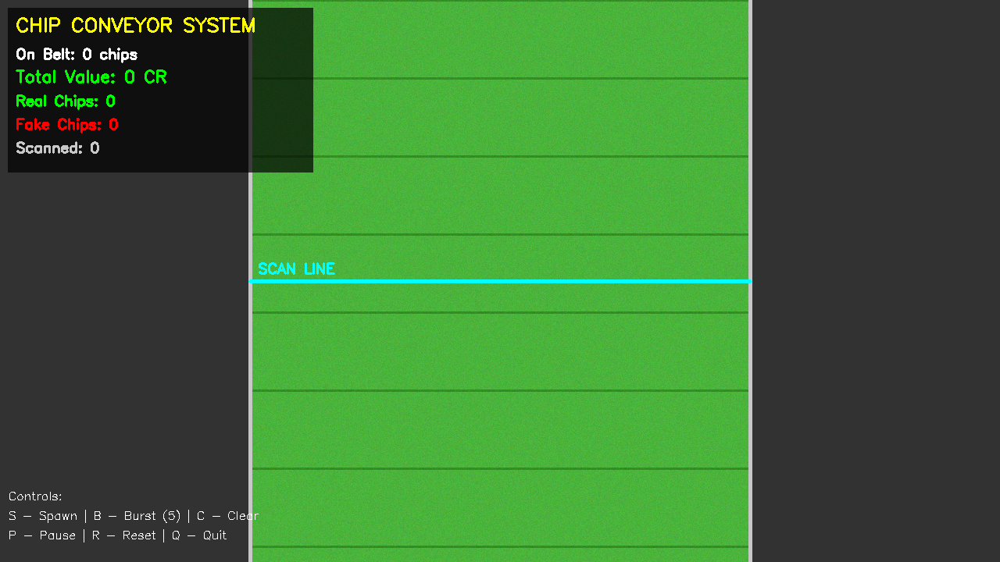
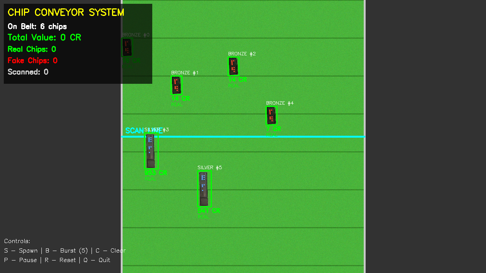
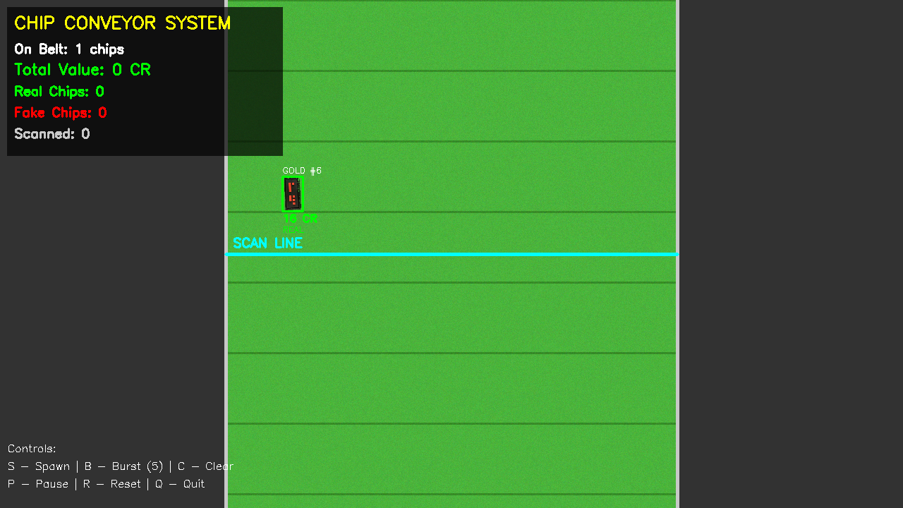
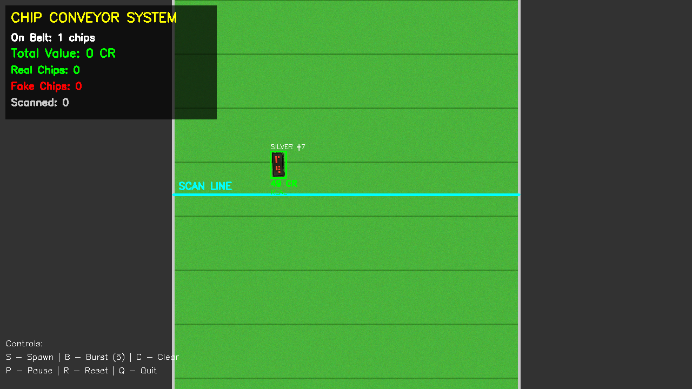
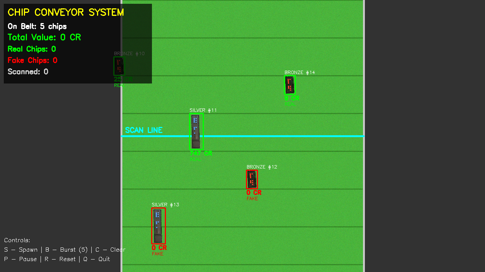

# Project Screenshots

## Intergalactic Riksbanken Chip Authenticator

**Authors**: Group 8 - Suneela, Sara, and Abhishek

---

### 1. Empty Conveyor Belt

The initial state showing the green conveyor belt (50% screen width, centered) with scan line and statistics panel.

---

### 2. Multiple Chips in Motion

Several chips moving down the conveyor belt. Shows mix of Gold, Silver, and Bronze chips with real-time value calculation and statistics tracking.

---

### 3. Gold Chip Detection

Individual Gold chip with:
- Yellow color coding
- 3-digit number display
- Value calculation: digits × 10
- Real-time annotation

---

### 4. Silver Chip Detection

Silver chip showing:
- Gray color coding
- Direct 3-digit value
- Bounding box in green (authentic)
- Value display in CR (Credits)

---

### 5. Bronze Chip Detection

Bronze chip with:
- Orange color coding
- Multiplied digit value
- Position on conveyor belt
- Authenticity marker

---

### 6. Fake Chip Detection

Counterfeit chip identified by:
- Red bounding box
- "FAKE" label
- Zero value (0 CR)
- Not counted in total value

---

### 7. Full Simulation

Complete system demonstration showing:
- Multiple chip types simultaneously
- Real-time statistics panel (top-left)
- Total value accumulation
- Real vs Fake count tracking
- Control instructions (bottom-left)
- Scan line in center
- FPS display

---

## System Features Demonstrated

✅ **Color-coded Detection**: Gold (Yellow), Silver (Gray), Bronze (Orange), Fake (Red)  
✅ **Real-time Processing**: 60 FPS in simulator mode  
✅ **Value Calculation**: Automatic computation based on chip type  
✅ **Statistics Tracking**: Live total value and chip counts  
✅ **Visual Feedback**: Clear annotations and status indicators  
✅ **Conveyor Physics**: Realistic perpendicular movement  

---

## Technical Details

- **Resolution**: 1280 × 720 pixels
- **Belt Width**: 640 pixels (50% of screen)
- **Processing**: OpenCV + NumPy
- **Color Space**: HSV for robust detection
- **Alpha Blending**: PNG transparency support

---

**Project**: STB600 Final Project 2025  
**Group**: 8  
**Members**: Suneela, Sara, Abhishek
